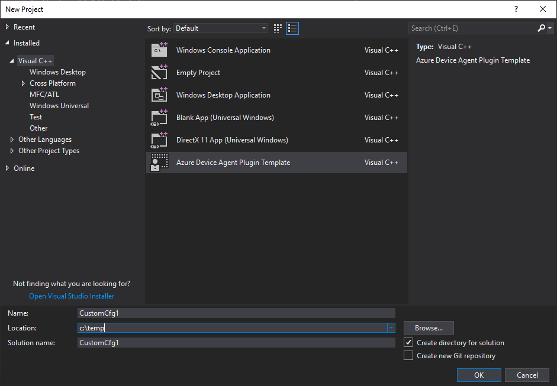

# Adding a New Plugin as a Standalone Project

## Overview

Developers can create their own custom plug-ins and host them in separate repos - public or private.
The plug-ins source code can then be built, signed, and packaged in the device image along with the device agent and other plug-ins as needed by the device builder.

## Getting the Agent SDK

The repo comes with pre-built **debug** nugets that you can directly consume into your project.
The nugets can be found here:

- `downloads/azure-device-agent-plugin-lib.2.0.0.nupkg`

If you make changes to the agent libraries source code, you can generate those nugets by following the instructions on the [SDK Build](sdk-build.md) page.

**Note: There is a bug currently where the nuget cannot be consumed for both debug and release builds. A temporary work around is to use the pre-built debug nuget for testing, and when the code is ready for release, a release nuget can be generated and will replace the debug nuget. We are working on a fix for this issue.**

## Create The Plugin Using a VS Template

- Configure the nuget path to point to the newly created nuget
    - Tools | Nuget Package Manager | Package Manager Settings
    - Add the local path where the nuget is generated.

- Install The VS Template
    - Copy 
        - `downloads/AzureDeviceAgentPluginTemplate.zip`
        - to
        - `"C:\Users\<user_name>\Documents\Visual Studio 2017\Templates\ProjectTemplates\Visual C++ Project"`
    - Shut down Visual Studio.
    - Run
        - `"C:\Program Files (x86)\Microsoft Visual Studio\2017\Enterprise\Common7\IDE\devenv.exe" /updateconfiguration`.
    - Start Visual Studio.
    - Navigate to File | New | Project | Visual C++
        
    - Select `Azure Device Agent Plugin Template`.
    - Create a new project...

- Navigate to the nuget Package Manager Console in VS.
- Restore the nuget package.
- Build.

## Create The Plugin Manually

### Create a Blank Dll Project

- Start Visual Studio.
- Navigate to File | New | Project | Visual C++ | Windows Desktop
- Select `Dynamic-Link Library (DLL)`
- Create a new project...

### Add Plugin SDK References

Add references to the Azure Device Agent headers and libraries. There are two options:

1. Using the expanded SDK layout:
    - Configure the compiler:
        - Project Properties | C/C++ | General
            - Set `Configuration` to `All Configurations`
            - Set `Platform` to `All Platforms`
            - Set `Additional Included Directories` to `C:\deploy.sdk\Includes`

    - Configure the linker:
        - Project Properties | Linker | General
            - Set `Additional Library Directories` to `c:\deploy.sdk\$(TargetedSDKArchitecture)\$(Configuration)`

        - Project Properties | Linker | Input | Additional Dependencies
        <pre>
        AzureDeviceManagementUtilities.lib;AzureDeviceManagementCommon.lib;AzureDeviceManagementPluginCommon.lib;Crypt32.lib
        </pre>

2. Using the nuget you built:
    - Tools | Nuget Package Manager | Package Manager Settings
    - Add the local path where the nuget is generated.
    - Start `Package Manager Console`.
    - Run `install-package azure-device-agent-plugin-lib -source <folder>`

----

## Related Topics

- [Extensibility and Discovery Model](../extensibility-and-discovery-model.md).
- [Handler Enumeration and Initialization Flow](../extensibility-and-discovery-model/handler-enumeration-flow.md).
- [Debugging](debugging.md).

----

[Home](../../../README.md) | [Device Agent](../device-agent.md) | [Development Scenario](../development-scenario.md) | [Plug-in Creation Walk-Through](developer-plugin-creation.md)
