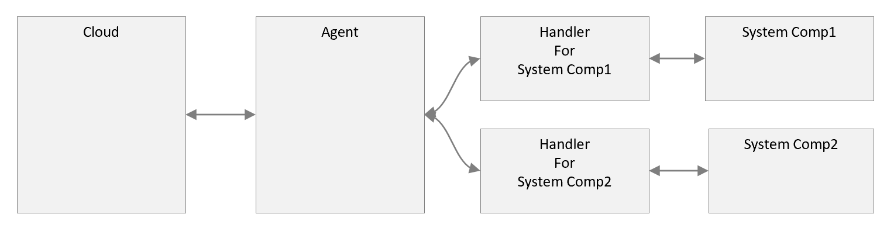
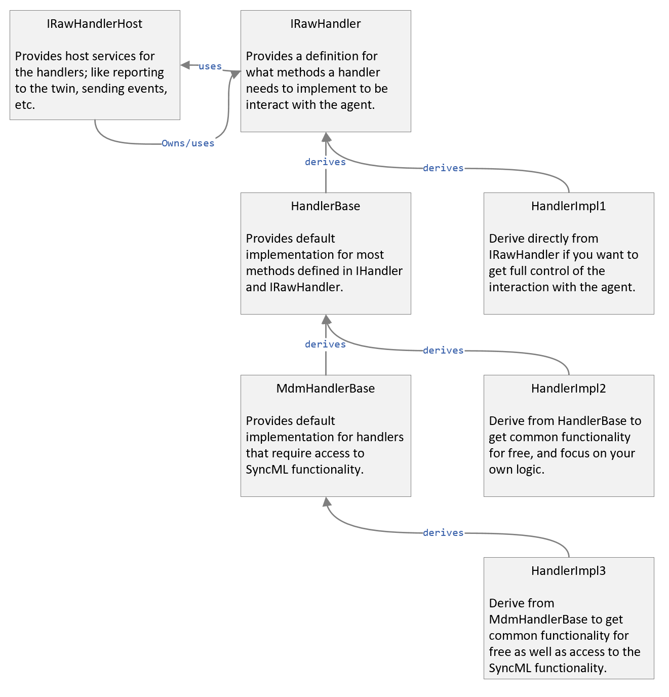

# Implementing Json Interfaces

## Overview

A handler acts as a translation bridge between the device agent, which owns the connection to the cloud among other things, and the corresponding system components.

A handler should be able translate a subset of the twin configurations into system calls or configuration updates that alters the target component.
In addition, it needs to cooperate with the agent so that such functionality can be achieved reliability, consistently, and correctly.

This cooperation is represented by the interfaces that both the agent and the handler have to implement - namely; `IRawHandlerHost` and `IRawHandler`.

As a handler developer, you can derive your implementation directly from `IRawHandler`, and implement all the necessary methods. However, most of the method implementations tend to be common across handlers, so we have provided a common base class to make development faster and more consister; `HandlerBase`.

Some handlers need the ability to submit CSP commands through SyncML, for those, we have provided a common base; `MdmHandlerBase` that facilicates such functionality.

Below is a class diagram of the various base classes and their relationship to each other.

## Quick Start

The fastest way to create a new plugin with a new handler is to use the provided VS template.
See the instructions on the [Adding a New Plugin as a Standalone Project](plugin-build-standalone.md) page.

In the following sections, you will find an explanation of the various components generated by the template.

## Deriving from HandlerBase

Deriving your handler implementation from `HandlerBase` takes care of a lot of the mechanics of talking to the device agent.

The author, in most cases, has to provide custom implementation for all or some of the following methods:

- [HandlerBase::Start()](sdk/handler-base/handler-base.md)
    - This method gets called by the agent every time the handler is loaded. It gives the handler the opportunity to start any background tasks if it needs to.
    - At this point, the connection to Azure is not ready. The handler should not attempt reporting properties for example.
    - This method gets called with the configuration that the device builder set for this handler in the AzureDeviceManagementClient.json file. The configuration is also augmented with attributes from the agent; such as the log file folder (if specified).

- [HandlerBase::Stop()](sdk/handler-base/handler-base.md)
    - This method gets called by the agent every time the handler is about to be unloaded. It gives the handler the opportunity to stop any backgroudn tasks or release any resources it is holding.

- [HandlerBase::OnConnectionStatusChanged()](sdk/handler-base/handler-base.md)
    - This method gets called by the agent every time connection to Azure IoT Hub is established or lost. If the new state is online, the handler can start reporting properties or sending events. Otherwise, it should stop.

- [HandlerBase::Invoke()](sdk/handler-base/handler-base.md)
    - This method gets called every time the twin desired properties for the target handler change.
    - It is called with a json snippet containing the changed attributes and their parents.
    - The implementation is expected to parse this snippet and configure the corresponding component accordingly.

## Deriving from MdmHandlerBase

`MdmHandlerBase` extends `HandlerBase`. So, in addition to what `HandlerBase` offers, it also provides a ready-to-use [MdmProxy](sdk/mdm-proxy/mdm-proxy.md) class instance to submit SyncML commands.

The `MdmProxy` instance can be accessed through the protected data member `_mdmProxy`.

## Wiring Handlers

A plug-in is a container of one or more handlers. When the agent dicovers a plug-in, it also discovers what handlers are implemented within the plugin.
The plugin needs to be able to instantiate the contained handlers upon the agent's request. In order for this to work, the handler's developer needs to register a handler factory function with the plugin.

The plugin class that's responsible for this is the [PluginStub](sdk/plugin-stub/plugin-stub.md) class.

- Edit new file 'Comp1Plugin.cpp' ([Sample](TemplateFiles/TemperatureSensorPlugin.cpp)).

    <pre>
    PluginStub gPluginStub;
    std::shared_ptr<IRawHandler> gComp1InterfaceHandler;

    std::shared_ptr<IRawHandler> CreateComp1InterfaceHandler()
    {
        if (gComp1InterfaceHandler == nullptr)
        {
            gComp1InterfaceHandler = make_shared<Comp1InterfaceHandler>();
        }
        return gComp1InterfaceHandler;
    }

    int __stdcall PluginCreate()
    {
        gPluginStub.Initialize();
        gPluginStub.RegisterRawHandler(InterfaceId, CreateComp1InterfaceHandler);
        return PLUGIN_ERR_SUCCESS;
    }
    </pre>

- Create the exports:
    - In this step, we create the exports so that the dll can be loaded by either the AzureDeviceManagementClient.exe directly (in-proc) or by the AzureDeviceManagementclientHost.exe (out-of-proc).
    - Add new file 'Comp1Plugin.def' ([Sample](TemplateFiles/TemperatureSensorPlugin.def)).
    - Include the function standard implementation for the entry points by including `#include "Includes\PluginCommon\PluginExports.h"`

## Class Reference

####  Raw Handlers Interfaces

- [IHandler](sdk/i-handler/i-handler.md)
- [IRawHandler](sdk/i-raw-handler/i-raw-handler.md)
- [IRawHandlerHost](sdk/i-raw-handler-host/i-raw-handler-host.md)

#### Raw Handlers Default Implementations

- [HandlerBase](sdk/handler-base/handler-base.md)
- [MdmHandlerBase](sdk/mdm-handler-base/mdm-handler-base.md)

#### Helpers

- [Operation](sdk/operation/operation.md)

#### Common Types

- [MdmProxy](sdk/mdm-proxy/mdm-proxy.md)
- [PluginStub](sdk/plugin-stub/plugin-stub.md)

## Related Topics

- [Device Agent SDK Reference](sdk/reference-sdk.md)

----

[Development Scenario Walk-Through](../development-scenario.md) | [Authoring New Plugins](developer-plugin-creation.md)
