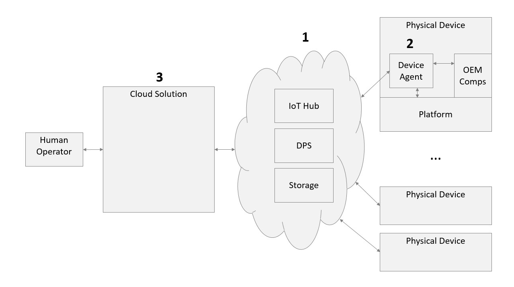

# Azure IoT Device Agent

## Overview

Microsoft Azure provides scalable and secure cloud services that enable a large number device management scenarios. Those services are the cloud infrastructure connecting operators to devices.

As shown in the diagram, to have an end-to-end solution, the following components need to be present:
- A cloud infrastructure.
- A device agent to connect various components on the physical device to the cloud services.
- A cloud solution to present the various cloud services in a format suitable for the operator scenario.

## The Cloud Infrastructure

The cloud infrastructure is provided by Azure. You can read about the various services here:
- [Azure IoT Hub](https://docs.microsoft.com/en-us/azure/iot-hub/)
- [Azure Device Twins](https://docs.microsoft.com/en-us/azure/iot-hub/iot-hub-devguide-device-twins)
- [Azure Device Provisioning Service](https://docs.microsoft.com/en-us/azure/iot-dps/)
- [Azure Storage](https://azure.microsoft.com/en-us/services/storage/)

## The Device Agent and the Cloud Solution

Both the device agent and the cloud solution can be implemented by using the Azure SDKs provided for the above mentioned services. However, given the commonality of many of their functions, there are multiple offerings that can give a head start.

### The Cloud Solution

For the cloud solution, Microsoft provides:
- [Azure IoT Central](https://azure.microsoft.com/en-us/services/iot-central/)
- [Azure Solution Accelerators](https://azure.microsoft.com/en-us/features/iot-accelerators/)

### The Device Agent

For the device agent, Microsoft provides a ready to build and package that:

- Manages the device identity provisioning with IoT Hub.
- Manages the cloud connection and its renewal.
- Provides a plug-in model for platform components which allows easy onboarding to various Azure services. This model includes discovery, initialization, error reporting, and state aggregation.
- Comes with a set of ready-to-ship plug-ins for very commonly used platform components.

#### Support Skus

The device agent can run on both the Windows IoT Core sku and the Windows IoT Enterprise sku. More information can be found on the [Supported Skus](supported-skus.md) page.

#### Get Started!

The device agent is an open source project that is share in this repo.

- [Quick Starts](quick-start.md)
- [Development Scenario Walk-through](development-scenario.md)
- [Device Agent Reference](reference.md)

----

[Home](../../README.md)
