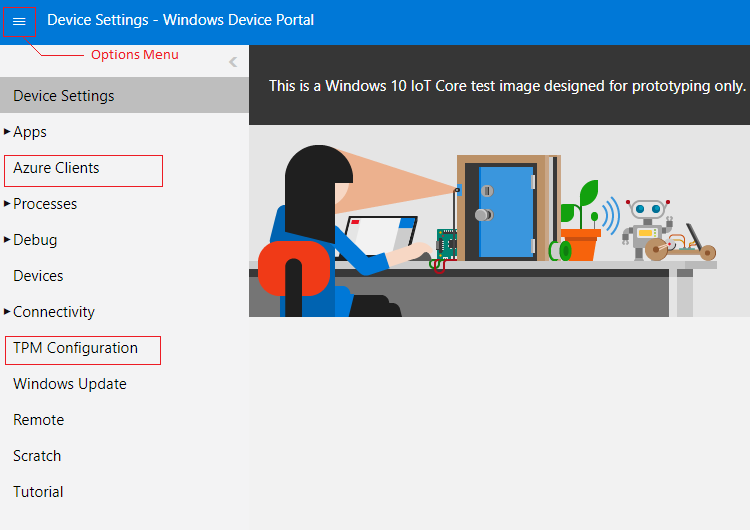
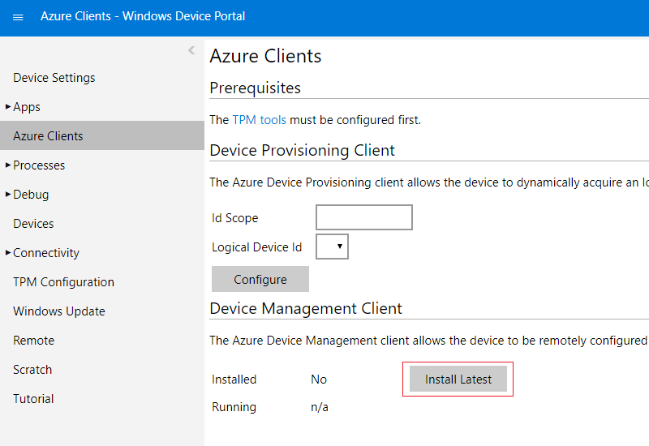

# Installing Pre-built Binaries

## Overview

To ease testing scenarios, we are providing a set of pre-built binaries so that they can be downloaded and used right away.

These binaries are not signed and should not be used in a production environment.

The binaries can be downloaded in either of two ways:
- To your developement box as a zip file that you can extract and deploy the files you need to the target device.
    - This works for both Windows Iot Core and Windows IoT Enterprise skus.
- Directly unto your device using the Windows Device Portal (WDP).
    - This works only for Windows IoT Core sku.

## Using The Zip Files

- Download the architecture matching your target device:
    - [device.agent.2.0.0.4.arm.zip](../../downloads/device.agent.2.0.0.4.arm.zip).
    - [device.agent.2.0.0.4.x64.zip](../../downloads/device.agent.2.0.0.4.x64.zip).
    - [device.agent.2.0.0.4.x86.zip](../../downloads/device.agent.2.0.0.4.x86.zip).
- Extract and copy to the device.

## Using WDP

- Navigate to the device portal (WDP) using your browser (by typing http://&lt;ip&gt;:8080).
- Make sure you can see both: `Azure Clients` and `TPM Configuration`. They might not show up if the browser connected to devices with older versions of Windows and is using a cached copy of the UI.
    - If you do not see either one, clear the browser cache and refresh the page.
    - Another way to make sure they are visible is to click the `Options menu` at the top left corner, and then `Add tools to workspace`, select both of them and then click `Add`.
        

- On the left pane, click 'TPM Configuration'
    - The 'TPM Configuration' page shows whether the TPM Tools are Installed or not. Make sure the latest tools are installed by clicking "Install Latest". Limpet.exe will be installed to `c:\windows\system32`.
          

- On the left pane, click 'Azure Clients'.
    - The 'Azure Clients' page shows whether the Azure Client tools are installed or not. Make sure the latest tools are installed by clicking "Install Latest". The files will be downloaded to `c:\dm` on your device.
          
