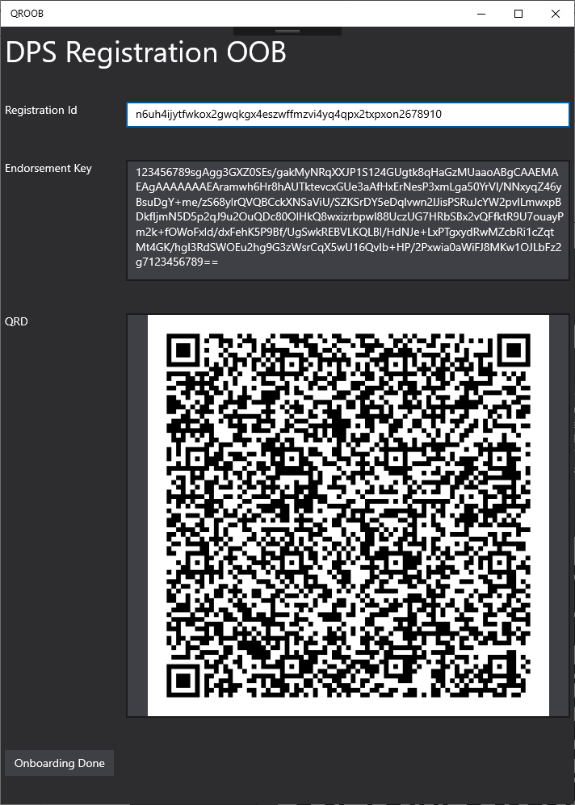
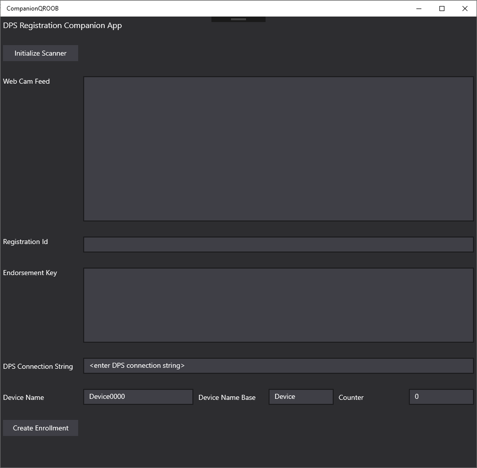

# Provisioning Using QR Codes

## Overview

In order to use the TPM with DPS provisioning, the TPM identity needs to be read from the device and then used to create an enrollment in DPS.

If the manufacturing process can print the TPM identity on the box in the form of a QR code, then the OEM can just scan each box and create an enrollment in DPS through.
This process would take a few seconds per device to register each device with DPS.

However, in some cases, having the manufacturing process print the TPM identity on the box is not an option.
In such cases, the device has to be booted, and some software needs to be run on the device to extract the TPM identity and share it with the outside world.
Some possible ways of doing that are:

### Option 1

- Connect to the device using SSH or something similar.
- Run `limpet.exe -azuredps -enrollmentinfo`
- Copy the output into the DPS Azure Portal and create the enrollment.

This option poses significant problems for a production line:

- The production image has SSH - which can be an unwanted communication channel due to security concerns. Especially, that it will be used only once.
- The process is very time consuming as it is involves a lot of manual steps.

### Option 2

- Have an Out-of-Box (OOB) application on the device that runs only once on the first boot and does the following:
    - Extract the TPM identity.
    - Communicate the TPM identity to a companion application that is running on a phone or a desktop machine.
    - Once the enrollment is created, the OOB application can trigger the main device experience. For example:
        - Deactivate the OOB so it doesn't start on the next boot.
        - Activate the main application on the device along with other necessary services.
        - Reboot the device.

This option automates almost all the steps on the device.

The question now is how can the OOB application communicate the TPM identity to the other side of the world?

There are a number of possibilities here:

- Option A
    - The OOB displays the TPM identity in the form of a QR code. The QR code is then scanned by the companion application and used to create an enrollment.
- Option B
    - The OOB pairs with the companion application through blue-tooth. Once the companion application receives the TPM identity over blue-tooth, it can create the enrollment.

Below is a walk-through of achieving Option 2.A.

## Building The Device

- **The Azure Device Management Client**
    - Include the AzureDeviceManagementClient service binaries and its plug-ins.
    - Do not configure the service to be auto-start.
    - Modify modifying its AzureDeviceManagementClient.json to enable DPS and set the `ScopeId`.
        <pre>
          "dpsEnabled": true,
          "dpsScopeId": "...",
        </pre>

- **The OEM App**
    - Include the main application your device will be running.
    - Do not configure it to be auto-start/foreground.
    - For a sample, see the [OEMApp](../../../Code/Samples/OOB/OEMApp) sample.

- **The OOB Experience**
    - Because in this walk-through the device displays a QR code, we will need UI framework, so we will need a UWP application.
    - The UWP application cannot access the TPM or configure other services on its own, so it will need to rely on a 'bridge' service to do that. We'll call that service the DMBrdige service.
        - **The OOB Service**
        - Include OOB service and configurate to be auto-start/auto-recover:
            <pre>
            c:\windows\system32\sc.exe config SystemConfiguratorBridge start=auto
            c:\windows\system32\sc.exe failure SystemConfiguratorBridge reset= 0 actions= restart/0/restart/0/restart/0
            </pre>
        - For a sample, see the [DMBridge](https://github.com/ms-iot/device-management-bridge) sample.
            - Build the solution for three architectures.
            - Create the nuget using [PackDMBridgeComponent.cmd](https://github.com/ms-iot/device-management-bridge/nuget/PackDMBridgeComponent.cmd).

    - **The OOB Application**
        - Include the OOB application your device will run only until the device is provisioned.
        - Configure it to be auto-start/foreground.
        - For a sample, see the [QEOOB](../../../Code/Samples/OOB/QROOB) sample.
            - Note that this sample comes with a [configuration file](../../../Code/Samples/OOB/QROOB/Content/finalize.config.json) that looks like this:
                <pre>
                {
                  "startupService": "AzureDeviceManagementClient",
                  "startupApp": "package-family-name of the the OEM App"
                }
                </pre>
                The `startupApp` will need to be modified to point to the real OEM app you are shipping on the device.
            - This sample relies on the DMBridge nuget you have built in the previous step.
                - Add the nuget path to the list of search path (Tools | NuGet Package Manager | Package Manager Settings | Package Resources).
            
             Below is a screen shot of the OOB sample application:
             
            

- Flash the image to the device.

## The Companion Application

The companion application needs to be able to read what OOB is sharing.
In this walk-through, the companion application needs to be able to read the barcode, and decode it into the TPM identity.

For convenience, we have included a sample [here](../../../Code/Samples/OOB/CompanionQROOB) and below is a screen shot.
 
 

 

## OOB Experience

- Start the device
- Wait till the QR code shows up.
- Scan it with the webcam attached to a computer running the companion app.
    - In the Componanion App sample, click `Initialize Scanner`
    - Scan the QR code.
    - Click `Create Enrollment`.
- On the device, in the OOB application, click `Onboarding Done`.

The device will now reboot and enroll in DPS, and then connect to IoT Hub.

----

[Device Agent](../device-agent.md)