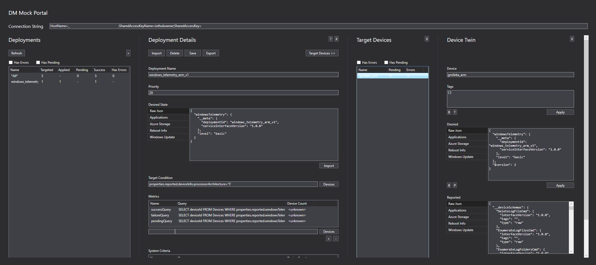

# DM Mock Portal

This tool allows the user to update devices individually or in bulk. It utilizes [Azure's ADM](https://docs.microsoft.com/en-us/azure/iot-hub/iot-hub-auto-device-config) service.

### Individual Update

- After insert the iothubowner connection string, click `Refresh`.
- Select the `All` deployment.
- In the `Deployment Details` pane, click the `Target Devices` button.
- Select the device of your choice, and paste the json you want applied.

### Bulk Update

- After inserting the iothubowner connection string, click `Refresh`.
- To create a deployment, click the `+`.
    - You can file-in the form and then click `Save`. OR
    - You can import a pre-existing deployment profile by clicking `Import` then `Save`.
        - The repo comes with a set of pre-defined deployment profiles:

            - [adm.device_schemas_reporting_v1.json](adm.device_schemas_reporting_v1.json)
            - [adm.reboot_schedule_v1.json](adm.reboot_schedule_v1.json)
            - [adm.windows_update_policy_v1.json](adm.windows_update_policy_v1.json)

- Once a deployment is created, the ADM service will pick them at some point (undeterministic).
- You can monitor their progress by hitting the `Refresh` button.

**Note 1**: Your device(s) must be running to be able to respond to the deployments.

**Note 2**: By default, we have device info and device schemas report on start-up. This allows deployments to use their reported properties for targeting.

-----

[Home](../../README.md)
