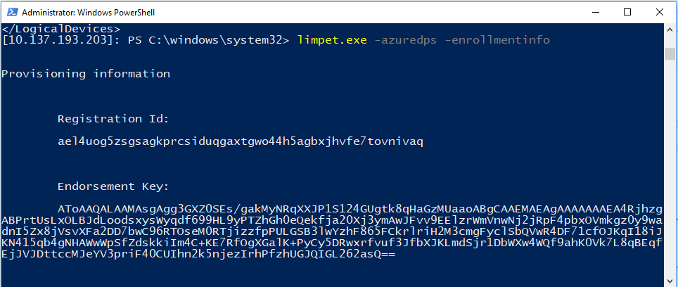
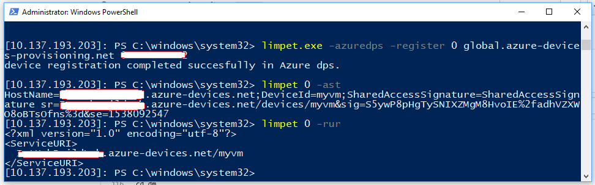

# Limpet.exe

## Overview

Limpet.exe allows local admin processess to use the TPM to securely store Azure connection strings, retrieve SAS tokens, and perform other related functions.
You can read more about the TPM technology on [MSDN](https://docs.microsoft.com/en-us/windows/security/information-protection/tpm/trusted-platform-module-top-node).

This enables many scenarios; and of particular interest to the device management scenario is the device provisioning scenario; i.e. the device acquirig of its own credentials - securely - to connect to its server.

Azure provides a device provisioning service - [Azure DPS](https://docs.microsoft.com/en-us/azure/iot-dps/about-iot-dps) - which can make use of the local TPM to provide an end-to-end secure provisioning scenario.
Limpet.exe and Limpet API can be used to implement a DPS client that provides that end-to-end scenario. For example, the [Azure IoT Device Agent](docs/device-agent/device-agent.md) is one such implementation.

The Azure DPS scenario requires TPM v2.0 and support for HMAC. Below, is a table of some of the common boards and whether they meet the DPS client requirements or not:

#### TPM Support

| Board | Version | Meets Azure TPM Requirements |
|-------|---------|---------|
| DragonBoard | 2.0 | Yes |
| RP2/3 | - | No |
| MBM   | 2.0 | No |

If you would like to use the DPS client for production or for testing, you can either use one of the boards with support from the above table, or use the software TPM. Note that software TPMs are not recommended for production scenarios.

## Command-line syntax
<pre>
Limpet.exe [Command]

 -VER => Show Limpet.exe version
 -LAT => List supported add-on TPMs
 -IAT [IDx] => Install specified add-on TPM where IDx is the index of the add-on from the output of `limpet.exe -LAT`.

Global TPM Present Commands:
 -GTI => Get TPM Info
 -FCT => Force Clear TPM
 -PFX [PFXFile] [password] => Import PFX file into TPMKSP and machine "My" Store
 -LLD => List logical devices in use
 -ERK {File} => Get TPM Endorsement RSA Key and optionally store

Logical Device Commands in the form:
Limpet.exe [LogicalDeviceNo 0..9] [Command] [Parameter] {Optional}
 -RID => Read Device Id
 -SUR [URI] => Store Service URI
 -RUR => Read Service URI
 -DUR => Destroy Service URI
 -PCS [connection string] => Provision connection string

HMAC Symmetric Identities:
 -CHK [HmacKey] => Create persisted HMAC Key
 -AST {Validity} => Generate the SAS token-based connection string (default validity 3600s)
 -SHK [File] => Sign data in file with persisted HMAC Key
 -EHK => Evict persisted HMAC Key

Azure device provisioning cloud service(dps) commands in the form:
Limpet.exe [-azuredps [<dps connection string>] [command] [parameters]

 -azuredps -register <tpm slot number> <global dps uri end point> <scope id> => register the current running device in Iothub using dps service.
     <tpm slot number>: tpm slot number to store the key.
     <global dps service uri>: it is generally fixed global.azure-devices-provisioning.net
     <scope id>: customer dps scope id. you can get this information from azure portal dps service ->overview ->id scope.
 -azuredps -enrollmentinfo <csv/json/txt> => read device tpm information needed for enrolling the device later in dps and output in given format.

</pre>

## Set up Limpet

### 1. Clone from github
Clone recursively:

    git clone --recursive https://github.com/ms-iot/azure-client-tools

If you find that the deps folder is empty, try this:

    git submodule update --init --recursive

### 2. Set up development environment

#### Install [CMake](https://cmake.org/download/)

  - Make sure it is in your PATH by typing "cmake -version" from a command prompt. CMake will be used to create Visual Studio projects to build libraries and samples. 
  - Make sure your CMake version is at least 3.6.1.

#### Install [perl](https://www.perl.org/get.html)

  - You can use either ActivePerl or Strawberry Pearl. Run the installer as an administrator to avoid issues.

#### Install Visual Studio 2017 with Visual C++

### 3. Build binaries for x86, ARM and X64

Follow these [Build](../device-agent/development-scenario/repo-build.md) instructions to build binaries for the target architecture.

The generated files will always be under:
<pre>
&lt;repo_root&gt;\code\output\&lt;architecture&gt\&lt;flavor&gt\limpet.exe
</pre>

Where
- &lt;architecture&gt; can be: `arm`, `x64`, or `win32`.
- &lt;flavor&gt; can be: `debug`, or `release`.

### 4. Setup Azure cloud resources

Setup cloud resources by following steps mentioned in [here](https://docs.microsoft.com/en-us/azure/iot-dps/tutorial-set-up-cloud) and gather the information below.

#### ID Scope
* You can get this from Azure portal.
* Device Provisioning Services -> Overview -> ID Scope.

#### Global device end point
* You can get from Azure portal
* Device Provisioning Services -> Overview -> Global device endpoint.  

### 5. Connect to the device using PowerShell

Start PowerShell by running as administrator in your development machine and use the commands below.

	$ip = "<Ip Address>"
	$password = "<administrator password>"
	$username = "administrator"
	$secstr = New-Object -TypeName System.Security.SecureString
	$password.ToCharArray() | ForEach-Object {$secstr.AppendChar($_)}
	$cred = new-object -typename System.Management.Automation.PSCredential -argumentlist $username, $secstr
	Set-Item -Path WSMan:\localhost\Client\TrustedHosts -Value "$ip" -Force
	$session = New-PSSession -ComputerName $ip -Credential $cred
	Enter-Pssession $session

If you are having trouble using remote PowerShell connection see https://developer.microsoft.com/en-us/windows/iot/docs/powershell.

### 6. Enroll the device in DPS
* Set up a Windows IoT device following the instructions [here](https://docs.microsoft.com/en-us/windows/iot-core/windows-iot-core#getting-started)
* Set up TPM on the IoT device following the instructions [here](https://docs.microsoft.com/en-us/windows/iot-core/secure-your-device/setuptpm).
* Connect your device using PowerShell by using device administrator credentials from your development machine.
* Copy the following files to the same folder on your Windows IoT device:
  * `limpet.exe` (built in the previous step)
  * For debug builds: `ucrtbased.dll`, `vcruntime140d.dll`, `msvcp140d.dll`.
  * For release builds: `ucrtbase.dll`, `vcruntime140.dll`, `msvcp140.dll`.
* Run the limpet tool from remote PowerShell connection with this command:

      limpet.exe -azuredps -enrollmentinfo
    
You'll want to make note of the tool prints endorsement key and registration ID. 

Below is a screenshot for reference:
  
  

* Enroll the device in DPS by following TPM based devices steps [here](https://docs.microsoft.com/en-us/azure/iot-dps/tutorial-provision-device-to-hub#enrolldevice).

### 7. Register the device in IotHub using DPS.

* Run the command shown below in remote PowerShell connection to register the current device in IoT Hub using DPS:

        limpet.exe -azuredps -register <tpm slot number> <global dps uri end point> <scope id>
          <tpm slot number>: tpm slot number to store the key.
          <global dps service uri>: it is generally fixed global.azure-devices-provisioning.net
          <scope id>: customer dps scope id. you can get this information from azure portal dps service ->overview ->id scope.

### 8. Verification

You can verify that everything has been installed correctly using one of three options...

* Option 1: From the command line:

    	run "limpet <TPM_SLOT> -rur"
        It should display the service uri of the device, which confirms the device registered successfully in Azure IoT Hub.
	
    	run "limpet <TPM_SLOT> -ast"
        It should display the IotHub connection string of the device, which confirms the device registered successfully in Azure IoT Hub.

* Option 2: Using the Azure portal, then going to the IoT Hub Device Explorer and finding the device.

* Option 3: Use the [Device Management (DM) hello world application](<https://github.com/ms-iot/iot-core-azure-dm-client/blob/master/docs/dm-hello-world-overview.md>) to manage the device.

Here is a screenshot for reference (some information has been redacted):

### Learn more Azure device provisioning service

* [Blog](<https://azure.microsoft.com/de-de/blog/azure-iot-hub-device-provisioning-service-preview-automates-device-connection-configuration/>)
* [Documentation](<https://docs.microsoft.com/en-us/azure/iot-dps/>)
* [Service SDK (preview release)](<https://www.nuget.org/packages/Microsoft.Azure.Devices/>)
* [Device SDK](<https://github.com/Azure/azure-iot-sdk-c>)

